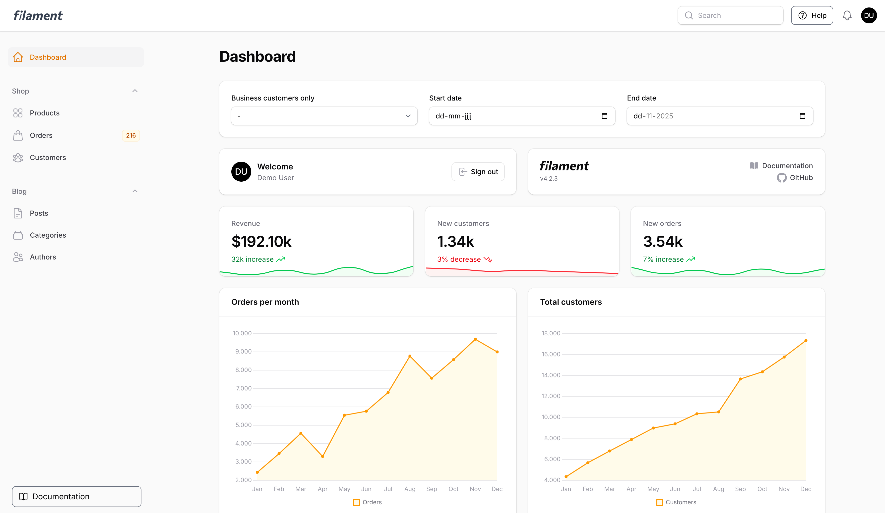
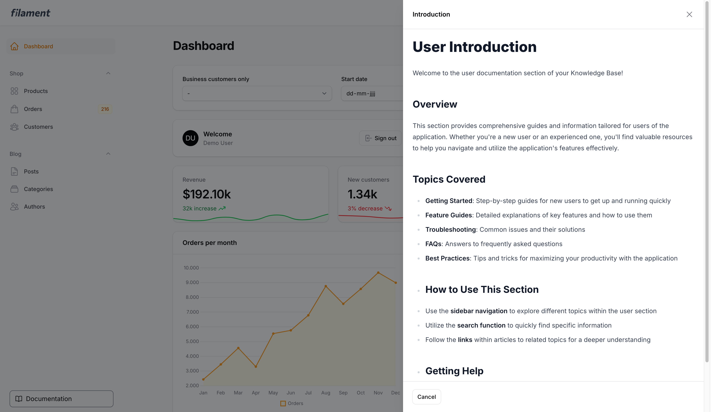
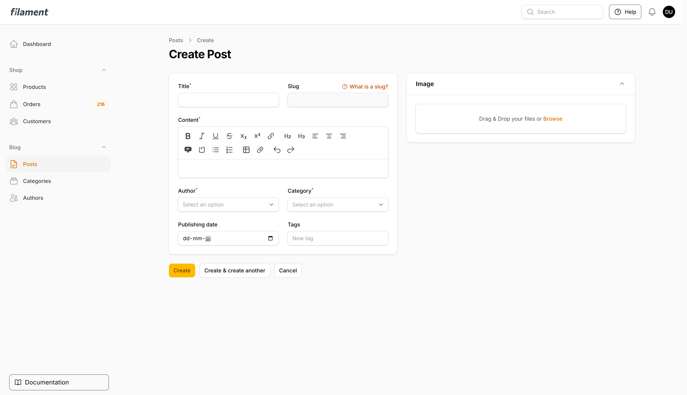
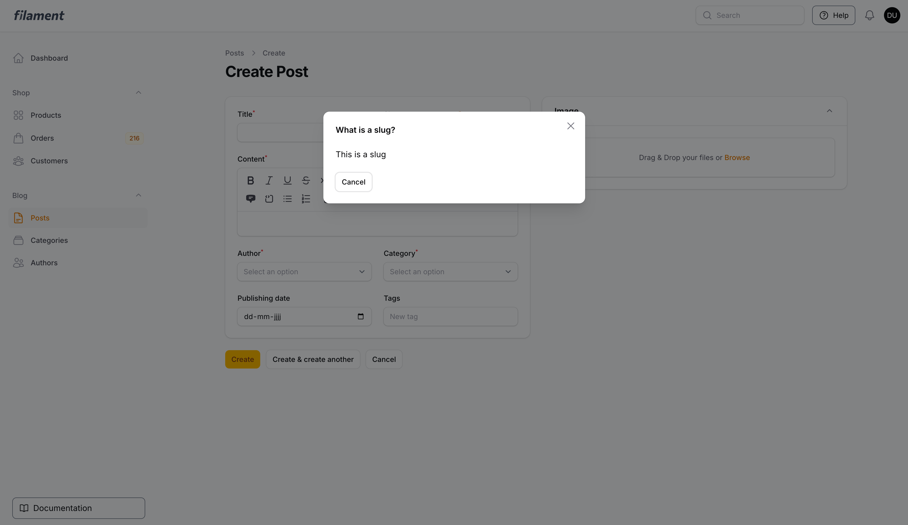
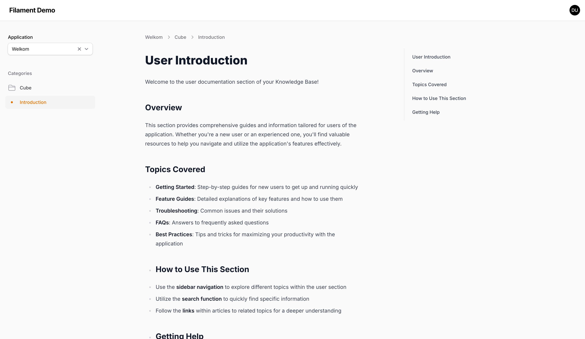
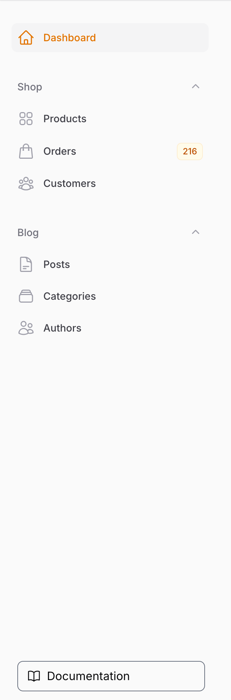

# WikiCube Knowledge Base for Filament

Welcome this is a package which integrates the WikiCube knowledge base into your Filament panels.


## Showcase






## Installation
You can install the package via composer:

```bash
composer require terpdev/cubewikipackage
```
In your .env file add your WikiCube API details:

```env
WIKICUBE_API_URL=https://wikicube.test // Your WikiCube URL
WIKICUBE_API_TOKEN=YOUR-API-TOKEN
WIKICUBE_APPLICATION_NAME=YOUR-APPLICATION-NAME
WIKICUBE_CACHE_ENABLED=true // Set to false to disable API response caching
WIKICUBE_CACHE_DURATION=5   // Cache duration in minutes
```
## Prerequisites

- PHP 8.1+
- Laravel 11.28+
- Filament v4+

## Introduction
This package allows you to see the CubeWiki knowledge base pages directly inside a Filament panel. 
Which is added when you install the package with an documentation button on the bottom of the sidebar.

This package comes with one plugin with multiple features, they are both for your regular Filament panels.


## CubeWikiAction plugins
The CubeWikiAction plugin has two features you can use to enhance your regular Filament panels

### HelpAction
The helpaction allows you to add an help button to the navbar beside your user menu, you can add
important pages to this button which open an dropdown and if you click on one of the 
pages it will open a slideover with the content of that page from your WikiCube knowledge base.

The pages get a slug in the API of WikiCube, add the right slug here to show it in the dropdown.
In the dropdown you will see the title of the page as it is in WikiCube.

Add this to your regular Filament panel provider:
```php
use TerpDev\CubeWikiPackage\Filament\CubeWikiPlugin;

public function panel(Panel $panel): Panel
{
    return $panel
        ->id('admin')
        ->path('admin')
        // ...
        ->plugins([
            CubeWikiPlugin::make()
                ->importantPages([
                    ['slug' => 'YOUR-SLUG-NAME'],
                ]),
            ])
       }
}
```
### Hint Action
The hintaction allows you to add hints to your Filament form components. for example if you want 
to show a hint for a slug field. This will add a help icon beside the field label, when you click
on the label it will open a modal with the content of that hint page from your WikiCube knowledge base.

Add this to your Filament form component schema:
```php
use Filament\Schemas\Schema;
use Filament\Forms\Components\TextInput;
use Filament\Schemas\Components\Section;
use TerpDev\CubeWikiPackage\Actions\Forms\Components\HelpAction as CubeWikiHelp;

public static function configure(Schema $schema): Schema
{
    return $schema
        ->components([
            Section::make()
                ->schema([
                    TextInput::make('slug')
                        ->label('Slug')
                        ->disabled()
                        ->required()
                        ->unique(Post::class, 'slug', ignoreRecord: true)
                        ->hintAction(CubeWikiHelp::make('YOUR-SLUG-NAME')
                                ->label('YOUR-SLUG-LABEL')
                            )
                ]),
])
}
```
## Accesing the Knowledge Base Panel
After installing the package it will automatically add an documentation button on the bottom of the sidebar
which links to the knowledge base panel.




Ontwikkeling & testen

- Run unit tests / pest: `composer test`
- Run phpunit: `./vendor/bin/phpunit`

Code stijl en linting

Volg de repository-conventies; gebruik PHP CS Fixer / Rector indien geconfigureerd in het project.

Contributie

1. Fork de repo
2. Maak een feature-branch
3. Maak je wijzigingen en tests
4. Open een pull request

License

Dit project valt onder de MIT-licentie. Zie `LICENSE.md` voor details.

Contact

Voor vragen of issues, open een GitHub issue in de originele repository of neem contact op via de repository-eigenaar.

---

Als je wilt, kan ik ook specifiek een korte sectie toevoegen met:
- Markdown-voorbeeld voor `env`-bestand
- Snelle debugging-checklist voor sticky/breadcrumb-problemen (met concrete CSS/JS fixes)
- Voorstellen voor unit tests rond de View-logic (bijv. breadcrumbs alleen tonen wanneer een pagina is geselecteerd)

Laat weten welke van die extra's je wil, dan voeg ik ze direct toe.

