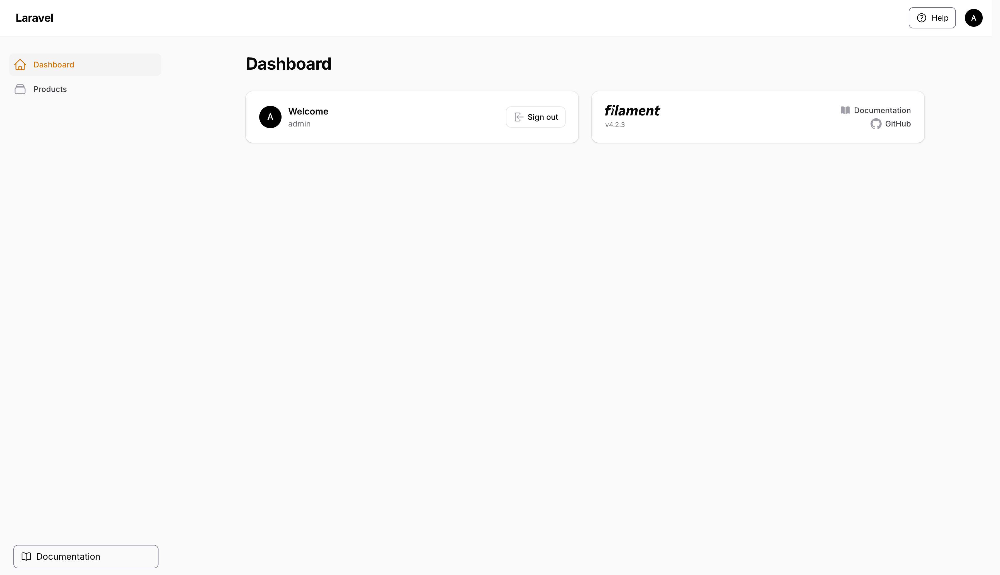
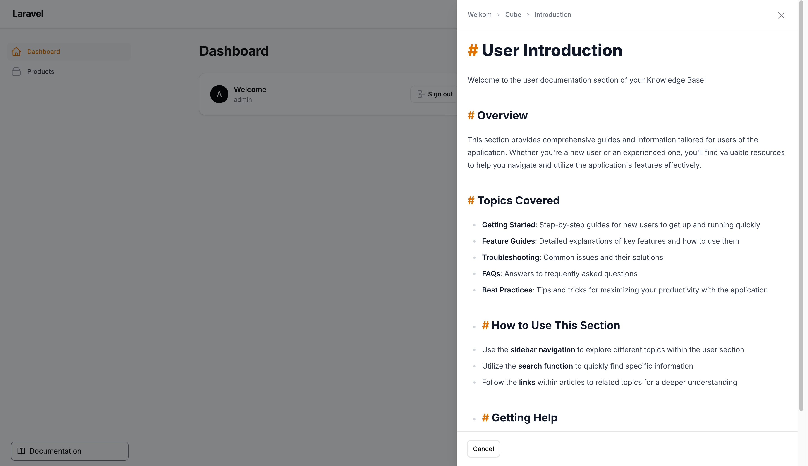
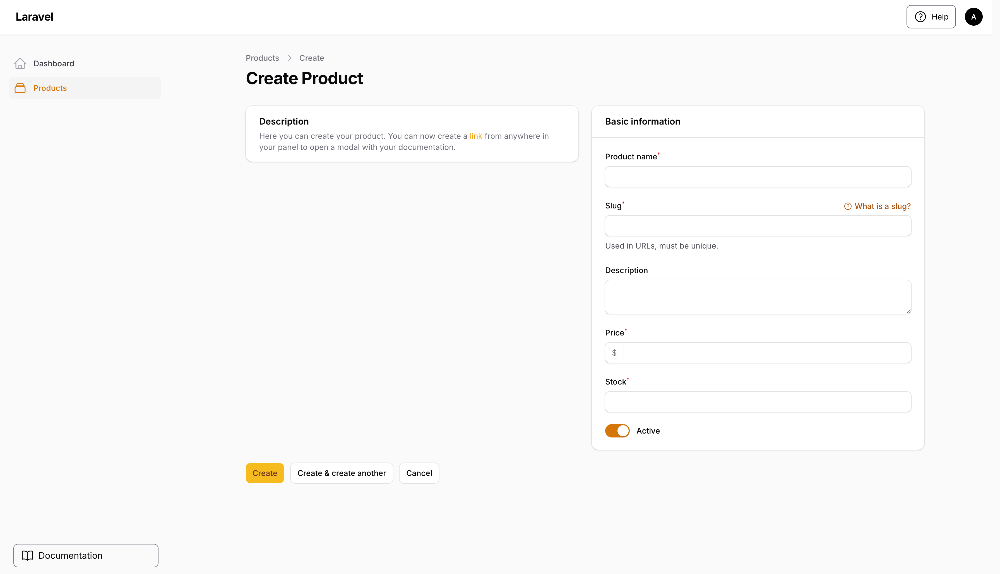
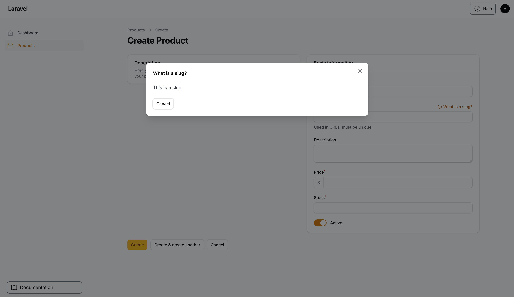
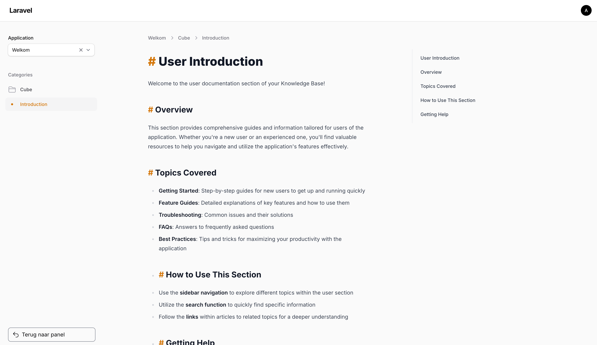
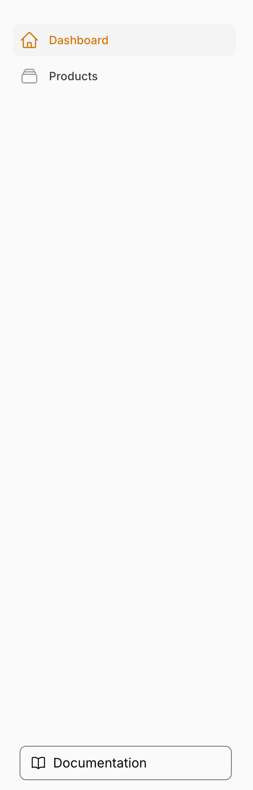

# WikiCube Knowledge Base for Filament

Welcome this is a package which integrates the WikiCube knowledge base into your Filament.


## Showcase





### Demo

https://github.com/user-attachments/assets/a5077dd8-a0cc-4f0a-833b-5f7b6b94ac4d


## Installation
You can install the package via composer:

```bash
composer require terpdev/cubewikipackage
```
In your .env file add your WikiCube API details:

```env
WIKICUBE_API_URL=https://wikicube.test // The WikiCube API URL
WIKICUBE_API_TOKEN=YOUR-API-TOKEN
WIKICUBE_APPLICATION_NAME=YOUR-APPLICATION-NAME
WIKICUBE_CACHE_ENABLED=true // Set to false to disable API response caching
WIKICUBE_CACHE_DURATION=5   // Cache duration in minutes
```
## Prerequisites

- PHP 8.1+
- Laravel 11.28+
- Filament v4+

## Introduction
This package allows you to see the CubeWiki knowledge base pages directly inside a Filament panel. 
Which is added when you install the package with an documentation button on the bottom of the sidebar.

This package comes with one plugin with multiple features, they are both for your regular Filament panels.


## CubeWikiAction plugins
The CubeWikiAction plugin has two features you can use to enhance your regular Filament panels

### HelpAction
The helpaction allows you to add a help button to the navbar beside your user menu, you can add
important pages to this button which open a dropdown and if you click on one of the 
pages it will open a slideover with the content of that page from your WikiCube knowledge base.

The pages get a slug in the API of WikiCube, add the right slug here to show it in the dropdown.
In the dropdown you will see the title of the page as it is in WikiCube.

#### Example:
Add this to your regular Filament panel provider:
```php
use TerpDev\CubeWikiPackage\Filament\CubeWikiPlugin;

public function panel(Panel $panel): Panel
{
    return $panel
        ->id('admin')
        ->path('admin')
        // ...
        ->plugins([
            CubeWikiPlugin::make()
                ->importantPages([
                    ['slug' => 'YOUR-SLUG-NAME'],
                ]),
            ])
       }
}
```
### Hint Action
The hintaction allows you to add hints to your Filament form components. for example if you want 
to show a hint for a slug field. This will add a help icon beside the field label, when you click
on the label it will open a modal or slideover with the content of that hint page from your 
WikiCube knowledge base.

#### Example:
Add this to your Filament form component:
```php
use TerpDev\CubeWikiPackage\Actions\Forms\Components\HelpAction as CubeWikiHelp;

->hintAction(CubeWikiHelp::make('YOUR-SLUG-NAME')
        ->label('YOUR-SLUG-LABEL')
)
```
If you want a slideover instead of a modal add this to the hintaction:
```php
use TerpDev\CubeWikiPackage\Actions\Forms\Components\HelpAction as CubeWikiHelp;

->hintAction(CubeWikiHelp::make('YOUR-SLUG-NAME')
        ->label('YOUR-SLUG-LABEL')
        ->slideOver()
)
```

### Inline action
If you have a description field in your form component and it is really long you can also 
add a inline action to show the content of that field in a slideover. instead if 
of showing the full description in the form.
#### Example:
Add this to your Filament form component:
```php
use TerpDev\CubeWikiPackage\Actions\Forms\Components\HelpAction as CubeWikiHelp;

->description(
        CubeWikiHelp::parse(
            'You can now create a [[YOUR-SLUG|TEXT]]
             from anywhere in your panel to open a slideover
             with your documentation.'
        )
),
```
The YOUR-SLUG is the slug of the page in your WikiCube knowledge base and TEXT is the text
which will be shown in your description.

## Accesing the Knowledge Base Panel
After installing the package it will automatically add an documentation button on the bottom of the sidebar
which links to the knowledge base panel. 



If you want to disable this button to only use the helpaction and hintaction features you can do this:
#### Example:
By adding this to your Filament panel provider:
```php
use TerpDev\CubeWikiPackage\Filament\CubeWikiPlugin;

public function panel(Panel $panel): Panel
{
    return $panel
        ->id('admin')
        ->path('admin')
        // ...
        ->plugins([
            CubeWikiPlugin::make()
                ->disableDocumentation(),
            ])
       }
}
```
Then the documentation button will not be shown in the sidebar.

## Knowledge Base Panel
When you have clicked on the documentation button there will open a panel with the knowledge base pages
fetched from your API token and application name you filled in your .env file.

You will see a Terug naar panel button on the bottom of the sidebar to go back to your
regular Filament panel. If you have multiple Filament panels there will be a dropdown so you can choose which 
panel you want to go back to. When you have only one panel it will directly go back to that panel.

If you have multiple panels you can choose in each panel which name you want to give them in 
the dropdown with *->brandName* option otherwise it will choose the id of the panel as the name in the dropdown.

#### Example:
By adding this to your desired Filament panel provider:
```php
public function panel(Panel $panel): Panel
{
    return $panel
        ->id('admin')
        ->path('admin')
        // ...
        ->brandName('Admin Panel') // Name in the dropdown
         }
}
```
If you changed something in your WikiCube sometimes the cache needs to be cleared to see the changes.
You can do this by running the following commands in your project root:

```bash
php artisan cache:clear 
```
## Testing

```bash
composer test
```

## Changelog

Please see [CHANGELOG](CHANGELOG.md) for more information on what has changed recently.

## Contributing

Please see [CONTRIBUTING](CONTRIBUTING.md) for details.

## Security Vulnerabilities

Please review [our security policy](../../security/policy) on how to report security vulnerabilities.

## Credits

- Spatie - Our package skeleton is a modified version
  of [Spatie's Package Tools](https://github.com/spatie/laravel-package-tools)

## License

The MIT License (MIT). Please see [License File](LICENSE.md) for more information.
